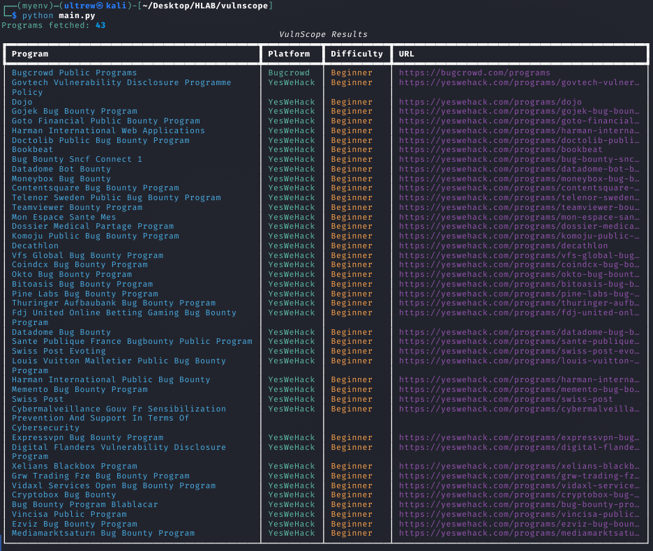
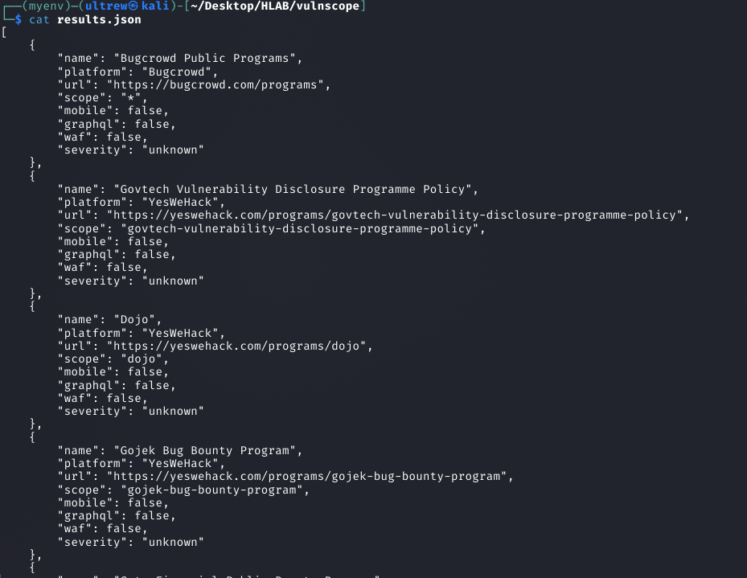
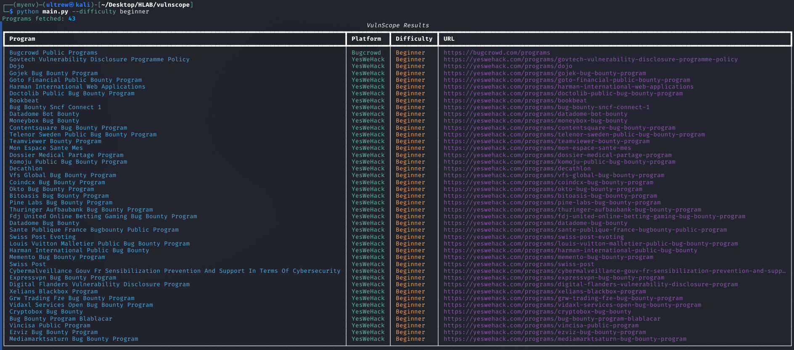
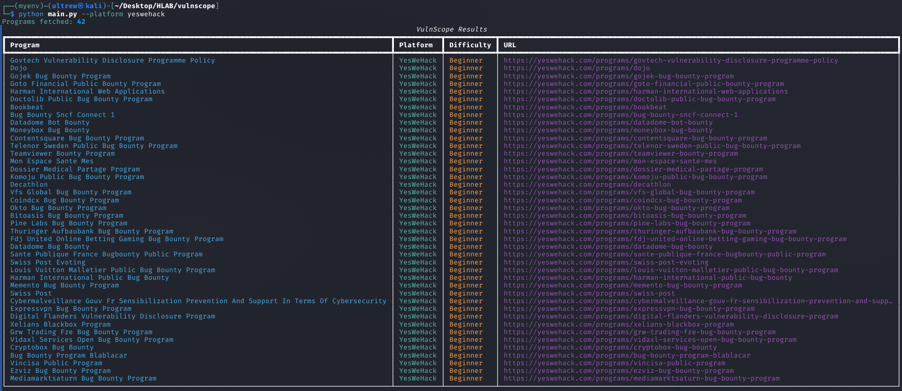
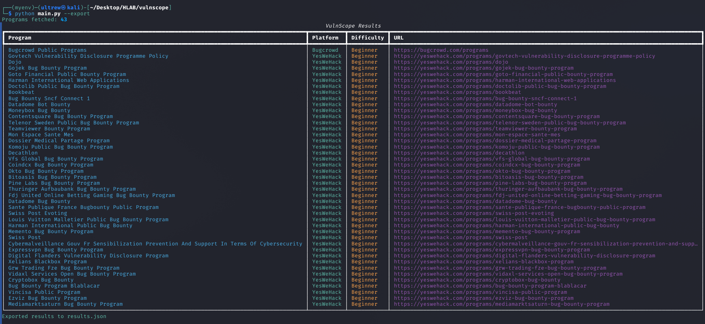

# VulnScope

VulnScope is a Python-based CLI tool for aggregating, filtering, classifying, and exporting Vulnerability Disclosure Program (VDP) and bug bounty targets from multiple platforms.

The project focuses on reconnaissance workflow automation and structured target discovery through a modular architecture.

---

## Features

- Multi-platform bug bounty aggregation
- VDP target collection
- Difficulty-based filtering
- Platform-specific filtering
- Automated target classification
- Recon scoring system
- JSON and Markdown export support
- Modular source integration
- CLI-driven workflow

---

## Supported Platforms

- HackerOne
- Bugcrowd
- YesWeHack

Planned / experimental integrations:

- Intigriti
- Federacy
- OpenBugBounty

---

## Screenshots

### Main Interface



---

### Results Output



---

### Difficulty Filtering



---

### Platform Filtering



---

### Export Output



---

## Installation

### Clone Repository

```bash
git clone https://github.com/ultrew/vulnscope.git
cd vulnscope
```

### Create Virtual Environment

```bash
python -m venv myenv
source myenv/bin/activate
```

### Install Dependencies

```bash
pip install -r requirements.txt
```

---

## Usage

### Start VulnScope

```bash
python main.py
```

### Example Workflow

```bash
python main.py scan
```

---

## Project Structure

```text
vulnscope/
├── cli/           # CLI command handling
├── core/          # Classification, scoring, recon logic
├── db/            # Database models
├── output/        # Export handlers
├── screenshots/   # README assets
├── sources/       # Platform integrations
├── main.py
└── README.md
```

---

## Output Formats

VulnScope currently supports:

- JSON export
- Markdown export

Generated results can be used for:

- Recon workflows
- Target tracking
- Bug bounty organization
- Research documentation

---

## Design Goals

- Lightweight architecture
- Modular source integrations
- Structured recon workflows
- Extensible export system
- Maintainable CLI design

---

## Legal Disclaimer

This project is intended for:

- Authorized security research
- Educational use
- Public bug bounty programs
- Vulnerability Disclosure Programs (VDPs)

Users are responsible for complying with applicable laws and platform policies.

---

## License

MIT License
